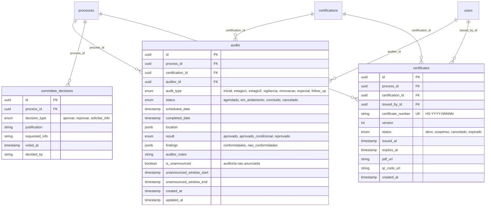

# 3. Database Schema (ERD)

**PostgreSQL 16 + pgvector | 40+ Tabelas | MVP em Produção: Janeiro 2026**

---

## 3.1 Diagrama Entidade-Relacionamento (Resumido)


---

## 3.2 Diagrama Detalhado - Core (Usuarios e Empresas)

```mermaid
erDiagram
    users {
        uuid id PK
        string email UK "NOT NULL"
        string password_hash "bcrypt"
        enum role "12 roles: admin, empresa, analista, auditor, gestor, comercial, juridico, financeiro, gestor_auditoria, supervisor, controlador, secretaria"
        string name "NOT NULL"
        string phone
        jsonb mfa_config "TOTP settings"
        boolean mfa_enabled "default false"
        int login_attempts "rate limiting"
        timestamp locked_until
        timestamp last_login
        boolean is_group_admin "admin do grupo"
        boolean is_company_admin "admin da empresa"
        boolean is_temporary_admin "admin temporario"
        timestamp created_at
        timestamp updated_at
    }

    companies {
        uuid id PK
        uuid user_id FK UK
        uuid group_id FK "CompanyGroup"
        string cnpj UK "14 digits"
        string razao_social "NOT NULL"
        string nome_fantasia
        jsonb address "CEP, rua, cidade, UF"
        jsonb contact "email, phone, whatsapp"
        string email "flat field"
        string telefone "flat field"
        string endereco "flat field"
        string cidade
        string estado
        string cep
        string pais
        string tipo_empresa
        boolean is_verified
        boolean is_active
        boolean is_headquarters "matriz do grupo"
        boolean pending_validation "aguardando FAMBRAS"
        timestamp created_at
        timestamp updated_at
    }

    company_groups {
        uuid id PK
        string name "NOT NULL"
        string trade_name
        string document "CNPJ holding"
        string contact_name
        string contact_email
        string contact_phone
        timestamp created_at
        timestamp updated_at
    }

    plants {
        uuid id PK
        uuid company_id FK
        string code "SIF ou interno"
        enum code_type "sif, sie, sim, internal"
        string name
        string address
        string city
        string state
        string postal_code
        string country "default BR"
        string production_capacity
        int employee_count
        int shifts_count
        boolean is_active
        timestamp created_at
        timestamp updated_at
    }

    users ||--o{ companies : "user_id"
    company_groups ||--o{ companies : "group_id"
    companies ||--o{ plants : "company_id"
```

---

## 3.3 Diagrama Detalhado - Solicitacoes e Processos

```mermaid
erDiagram
    requests {
        uuid id PK
        uuid company_id FK
        string protocol UK "REQ-20260115-00001"
        string company_name
        string cnpj
        enum request_type "nova, inicial, renovacao, ampliacao, manutencao, adequacao"
        enum certification_type "C1-C6, produto, processo, servico"
        uuid industrial_group_id FK
        uuid industrial_category_id FK
        uuid industrial_subcategory_id FK
        string contact_person
        string contact_email
        string contact_phone
        string facility_address
        enum product_origin "animal, vegetal, misto, quimico"
        jsonb product_details
        jsonb production_details
        string industrial_classification
        enum status "rascunho, enviado, pendente, em_analise, aprovado, rejeitado, cancelado"
        timestamp submitted_at
        uuid reviewer_id FK
        timestamp reviewed_at
        string review_notes
        string rejection_reason
        timestamp created_at
        timestamp updated_at
    }

    processes {
        uuid id PK
        uuid request_id FK UK
        uuid analyst_id FK
        uuid auditor_id FK
        enum current_phase "17 fases: cadastro_solicitacao ate certificado_emitido"
        enum status "16 status: rascunho ate suspenso"
        enum priority "baixa, media, alta, urgente"
        int days_in_phase
        timestamp estimated_end
        timestamp created_at
        timestamp updated_at
    }

    process_phase_history {
        uuid id PK
        uuid process_id FK
        int phase "1-12"
        timestamp entered_at
        timestamp exited_at
        int days_in_phase
    }

    process_history {
        uuid id PK
        uuid process_id FK
        enum status
        string notes
        uuid changed_by FK
        timestamp created_at
    }

    companies ||--o{ requests : "company_id"
    requests ||--|| processes : "request_id"
    users ||--o{ processes : "analyst_id"
    users ||--o{ processes : "auditor_id"
    processes ||--o{ process_phase_history : "process_id"
    processes ||--o{ process_history : "process_id"
```

---

## 3.4 Diagrama Detalhado - Classificacao Industrial (GSO 2055-2)


---

## 3.5 Diagrama Detalhado - Reestruturacao Certificacoes

```mermaid
erDiagram
    certifications {
        uuid id PK
        uuid company_id FK
        uuid plant_id FK
        string certification_number UK "HS-2026-001"
        enum certification_type
        uuid industrial_group_id FK
        uuid industrial_category_id FK
        uuid industrial_subcategory_id FK
        enum status "em_solicitacao, ativa, suspensa, cancelada, expirada, recusada"
        timestamp valid_from
        timestamp valid_until
        uuid analyst_id FK
        enum suspension_type "normal, entressafra"
        timestamp suspended_at
        timestamp max_suspension_date
        string suspension_reason
        enum cancellation_type "pos_suspensao, distrato"
        timestamp cancelled_at
        string cancellation_reason
        timestamp rejected_at
        string rejection_reason
        timestamp created_at
        timestamp updated_at
    }

    certification_scopes {
        uuid id PK
        uuid certification_id FK UK
        string description
        string production_capacity
        int num_employees
        int num_shifts
        timestamp created_at
        timestamp updated_at
    }

    scope_products {
        uuid id PK
        uuid scope_id FK
        string name
        string description
        string category
        enum origin "animal, vegetal, misto, quimico"
        enum status "ativo, pendente, removido"
        timestamp added_at
        timestamp removed_at
    }

    scope_facilities {
        uuid id PK
        uuid scope_id FK
        string name
        string address
        string city
        string state
        string country
        string postal_code
        string facility_type
        enum status
        timestamp added_at
        timestamp removed_at
    }

    scope_brands {
        uuid id PK
        uuid scope_id FK
        string name
        string logo_url
        enum status
        timestamp added_at
        timestamp removed_at
    }

    scope_suppliers {
        uuid id PK
        uuid scope_id FK
        string name
        string cnpj
        string ingredient_type
        boolean has_halal_certificate
        enum status
        timestamp added_at
    }

    certification_requests {
        uuid id PK
        uuid certification_id FK
        string protocol UK
        enum request_type
        enum status
        timestamp submitted_at
        timestamp completed_at
        uuid reviewer_id FK
        string change_description
        string change_type
        timestamp created_at
        timestamp updated_at
    }

    request_workflows {
        uuid id PK
        uuid request_id FK UK
        enum current_phase
        enum status
        enum priority
        uuid analyst_id FK
        uuid auditor_id FK
        int days_in_phase
        timestamp estimated_end
        timestamp created_at
        timestamp updated_at
    }

    certification_history {
        uuid id PK
        uuid certification_id FK
        string action "criacao, submissao, auditoria, etc"
        string action_description
        uuid request_id FK
        uuid document_id FK
        uuid audit_id FK
        uuid certificate_id FK
        uuid performed_by FK
        jsonb metadata
        timestamp performed_at
    }

    companies ||--o{ certifications : "company_id"
    plants ||--o{ certifications : "plant_id"
    certifications ||--|| certification_scopes : "certification_id"
    certification_scopes ||--o{ scope_products : "scope_id"
    certification_scopes ||--o{ scope_facilities : "scope_id"
    certification_scopes ||--o{ scope_brands : "scope_id"
    certification_scopes ||--o{ scope_suppliers : "scope_id"
    certifications ||--o{ certification_requests : "certification_id"
    certification_requests ||--|| request_workflows : "request_id"
    certifications ||--o{ certification_history : "certification_id"
```

---

## 3.6 Diagrama Detalhado - Documentos e Contratos


---

## 3.7 Diagrama Detalhado - Proposta Comercial

```mermaid
erDiagram
    pricing_tables {
        uuid id PK
        string version "v1.0, v1.1"
        timestamp effective_from
        timestamp effective_to
        boolean is_active
        jsonb base_prices "C1-C6 prices"
        jsonb product_multipliers
        jsonb shift_multipliers
        jsonb history_multipliers
        jsonb supplier_multipliers
        jsonb man_hour_rates
        jsonb travel_costs
        decimal accommodation_cost
        decimal document_analysis_fee
        decimal committee_fee
        decimal issuance_fee
        decimal tax_rate
        timestamp created_at
        timestamp updated_at
    }

    proposals {
        uuid id PK
        uuid process_id FK UK
        uuid certification_id FK
        uuid pricing_table_id FK
        jsonb calculation_inputs
        jsonb breakdown
        decimal total_value
        decimal manual_adjustment
        string adjustment_reason
        uuid adjusted_by FK
        decimal final_value
        enum status "rascunho, calculada, enviada, aceita, recusada, expirada"
        timestamp valid_until
        string pdf_url
        timestamp pdf_generated_at
        timestamp sent_at
        timestamp responded_at
        string response_notes
        timestamp created_at
        timestamp updated_at
    }

    pricing_tables ||--o{ proposals : "pricing_table_id"
    processes ||--|| proposals : "process_id"
    certifications ||--o{ proposals : "certification_id"
    users ||--o{ proposals : "adjusted_by"
```

---

## 3.8 Diagrama Detalhado - Auditorias e Certificados



---

## 3.9 Diagrama Detalhado - IA e Chat


---

## 3.10 Diagrama Detalhado - Notificacoes e Audit Trail


---

## 3.11 Diagrama Detalhado - E-Signature e Storage

```mermaid
erDiagram
    e_signature_configs {
        uuid id PK
        uuid company_id FK
        enum provider "clicksign, d4sign, docusign, adobe_sign, custom, none"
        string api_key
        string api_secret
        string webhook_url
        jsonb config
        boolean is_active
        boolean is_default
        timestamp created_at
        timestamp updated_at
    }

    signature_documents {
        uuid id PK
        uuid contract_id FK
        uuid config_id FK
        string provider_doc_id
        string signer_email
        string signer_name
        enum status "pendente, assinado, recusado, expirado, cancelado, rejeitado"
        timestamp signed_at
        timestamp refused_at
        string refusal_reason
        timestamp expires_at
        jsonb webhook_events
        string signed_document_url
        timestamp created_at
        timestamp updated_at
    }

    storage_configs {
        uuid id PK
        enum provider "s3, local, azure, gcp, cloudflare_r2"
        string access_key
        string secret_key
        string region
        string bucket
        string endpoint
        string cdn_url
        int max_file_size
        array allowed_types
        boolean is_default
        boolean is_active
        timestamp created_at
        timestamp updated_at
    }

    company_buckets {
        uuid id PK
        uuid company_id FK UK
        string bucket_name
        uuid storage_config_id FK
        string path
        bigint quota
        bigint used_space
        boolean is_active
        timestamp created_at
        timestamp updated_at
    }

    e_signature_configs ||--o{ signature_documents : "config_id"
    storage_configs ||--o{ company_buckets : "storage_config_id"
```

---

## 3.12 Diagrama Detalhado - CNPJ Lookup


---

## 3.13 Diagrama Detalhado - Grupos Empresariais


---

## 3.14 Relacionamentos Principais (Visao Geral)

```
                        ┌──────────────────┐
                        │  company_groups  │
                        └────────┬─────────┘
                                 │
        ┌────────────────────────┼────────────────────────┐
        ▼                        ▼                        ▼
┌──────────────┐        ┌──────────────┐        ┌──────────────────┐
│  companies   │        │shared_supplier│        │corporate_documents│
└──────┬───────┘        └──────────────┘        └──────────────────┘
       │
       ├───────────────┬──────────────────────────────────────┐
       ▼               ▼                                      ▼
┌──────────────┐  ┌──────────────┐                    ┌──────────────┐
│    plants    │  │  requests    │                    │certifications│
└──────────────┘  └──────┬───────┘                    └──────┬───────┘
                         │                                    │
                         ▼                                    ├─────────────────┐
                  ┌──────────────┐                            ▼                 ▼
                  │  processes   │                    ┌───────────────┐  ┌──────────────┐
                  └──────┬───────┘                    │cert_requests  │  │cert_scopes   │
                         │                            └───────┬───────┘  └──────┬───────┘
       ┌─────────────────┼─────────────────────┐              │                 │
       ▼                 ▼                     ▼              ▼           ┌─────┼─────┐
┌──────────────┐  ┌──────────────┐     ┌──────────────┐ ┌──────────┐     ▼     ▼     ▼
│  documents   │  │  contracts   │     │   audits     │ │workflows │  products brands suppliers
└──────────────┘  └──────────────┘     └──────────────┘ └──────────┘

users ─┬─→ processes (analista/auditor)
       ├─→ certifications (analista)
       ├─→ audit_trail
       ├─→ notifications
       └─→ chat_messages

industrial_groups ─→ industrial_categories ─→ industrial_subcategories
```

---

**Ultima atualizacao**: 24 de Janeiro de 2026
