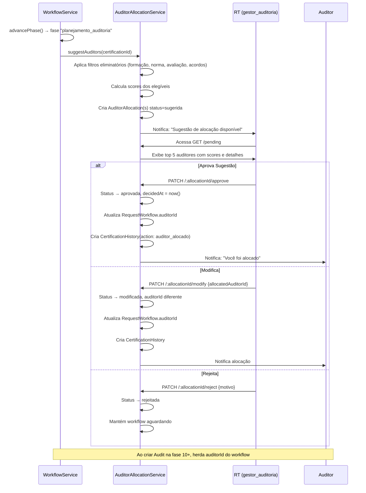

# Gestão de Alocação de Auditores por Competências

**Versão:** 2.0
**Data:** 2026-02-17
**Status:** Proposta (atualizada pós-reestruturação)
**Referências FAMBRAS:** FM 5.1.1, FM 6.1.1, FM 6.1.4, classifica_auditor

---

## 1. Visão Geral

Sistema inteligente de sugestão e gestão de alocação de auditores baseado em competências técnicas, formação acadêmica e categorias industriais (GSO 2055-2 / SMIIC). O sistema **sugere** alocações automaticamente, mas a **decisão final** é sempre do Responsável Técnico (RT) — role `gestor_auditoria` — ou gestor/admin.

### 1.1 Contexto Pós-Reestruturação (Fev/2026)

Este documento substitui a v1.0 (Dez/2025), que referenciava o model `Process` (removido em 16/02/2026). A arquitetura atual adota:

- **Certification** como aggregate root
- **Fluxo**: `Certification` → `CertificationRequest` → `RequestWorkflow` (17 fases)
- **FK principal**: `certificationId` em todos os models dependentes
- **Assignment dual**: `RequestWorkflow.auditorId` (nível workflow) + `Audit.auditorId` (nível auditoria)

### 1.2 Módulo Existente

O backend já possui o módulo `auditor-allocation` com 6 endpoints operacionais:
- Alocação/remoção por `workflowId`
- Listagem de auditores com workload
- Estatísticas de alocação
- Capacidade atual: hardcoded `< 5` workflows ativos (será configurável via `maxConcurrentAudits`)

Este documento propõe **estender** o módulo existente (não substituir).

### 1.3 Objetivos

- Mapear competências técnicas dos auditores conforme FAMBRAS FM 6.1.4
- Determinar elegibilidade por **formação acadêmica** → categorias industriais (regra `classifica_auditor`)
- Verificar **normas elegíveis** por auditor (GSO, OIC/SMIIC, BPJPH, MUIS, MS, UAE)
- Sugerir auditores mais qualificados para cada certificação
- Permitir que o RT (`gestor_auditoria`) aprove, modifique ou rejeite sugestões
- Manter histórico de alocações e performance
- Suportar **múltiplas funções SGQ** por pessoa (auditor + especialista + comitê)
- Gerenciar **suplentes (deputies)** e **avaliações periódicas** (ciclo 3 anos)

### 1.4 Base Normativa (Documentos FAMBRAS)

| Documento | Conteúdo | Impacto no Sistema |
|-----------|----------|---------------------|
| **FM 5.1.1** - Matriz de Responsabilidade (Rev 8) | 14 cargos, autoridades e responsabilidades | Define que o RT (cargo 4) decide alocação de auditores |
| **FM 6.1.1** - Matriz de Competências | Competências por cargo: conhecimento, habilidade, postura | Base para `AuditorCompetency` e critérios de matching |
| **FM 6.1.4** - Lista do Pessoal Qualificado | ~30+ pessoas com classificações, normas, suplentes | Dados reais para seed e validação do modelo |
| **classifica_auditor** | Mapeamento Formação → Categorias Elegíveis | Critério **eliminatório** no algoritmo de sugestão |

### 1.5 Cargos FAMBRAS Relevantes

| Cargo FM 5.1.1 | Descrição | Role no Sistema | Responsabilidade |
|-----------------|-----------|-----------------|------------------|
| **Cargo 4** - Responsável Técnico (RT) | Define auditores conforme competências | `gestor_auditoria` | **Decide** alocação de auditores, agenda auditorias |
| **Cargo 6** - Auditor Técnico | Formação superior na área da indústria | `auditor` | Executa auditorias técnicas nas categorias elegíveis |
| **Cargo 7** - Especialista Técnico | Suporte técnico (min 4 anos experiência) | `auditor` (sgqAppointment) | Suporte ao auditor em áreas especializadas |
| **Cargo 8** - Auditor Religioso/Sheikh | Cobre TODAS as categorias | `auditor` (sgqAppointment) | Aspectos religiosos da certificação halal |

---

## 2. Modelo de Dados

### 2.1 Nova Tabela: `AuditorCompetency`

Armazena o perfil de competências técnicas de cada auditor, incorporando os requisitos dos documentos FAMBRAS.

```prisma
enum CompetencyLevel {
  basico        // Conhecimento básico
  intermediario // Experiência moderada
  avancado      // Especialista
  certificado   // Possui certificação específica
}

enum EducationalBackground {
  agronomia
  alimentos
  veterinaria
  zootecnia
  quimica
  farmacia
  engenharia
  cosmeticos
  administracao
  economia
  outro
}

enum EligibleStandard {
  GSO        // Gulf Standards Organization (GSO 2055-2)
  OIC_SMIIC  // OIC/SMIIC 2
  BPJPH      // Badan Penyelenggara Jaminan Produk Halal (Indonesia)
  MUIS       // Majlis Ugama Islam Singapura (Singapore)
  MS         // Malaysian Standard
  UAE        // United Arab Emirates
}

enum SgqAppointment {
  auditor_tecnico
  auditor_religioso
  especialista_tecnico
  comite_decisao
  revisor
  responsavel_tecnico
}

model AuditorCompetency {
  id        String   @id @default(dbgenerated("uuid_generate_v4()")) @db.Uuid
  auditorId String   @map("auditor_id") @db.Uuid

  // === COMPETÊNCIA INDUSTRIAL ===
  industrialCategoryId String?         @map("industrial_category_id") @db.Uuid
  competencyLevel      CompetencyLevel @map("competency_level")
  certificationType    CertificationType? @map("certification_type")

  // === FORMAÇÃO E ELEGIBILIDADE (FAMBRAS classifica_auditor) ===
  educationalBackground EducationalBackground @map("educational_background")
  // A formação determina quais categorias o auditor pode cobrir:
  // - Agronomia/Alimentos/Veterinária/Zootecnia → GSO: AI-CV, DI-DII, E, FI-GII, HI, HIII, I, K
  // - Química → GSO: CI-CIV, CV, DI-DII, FI-GII, I, K
  // - Farmácia → GSO: CI-CIV, DI-DII, E, FI-GII, HI, HIII, I, K
  // - Engenharia → GSO: J (Fabricação de equipamentos)
  // - Cosméticos → SMIIC: LI

  // === NORMAS ELEGÍVEIS (FAMBRAS FM 6.1.4) ===
  eligibleStandards EligibleStandard[] @default([])
  // Cada auditor pode auditar sob diferentes normas internacionais

  // === FUNÇÕES SGQ (FAMBRAS FM 6.1.4) ===
  sgqAppointments SgqAppointment[] @default([])
  // Uma pessoa pode ter múltiplas funções:
  // Ex: auditor_tecnico + especialista_tecnico + comite_decisao

  // === SUPLENTE (DEPUTY) (FAMBRAS FM 6.1.4) ===
  deputyId String? @map("deputy_id") @db.Uuid
  // Suplente designado - se o auditor estiver indisponível, sugere o deputy

  // === AVALIAÇÃO PERIÓDICA (FAMBRAS FM 6.1.4 - ciclo 3 anos) ===
  lastAssessmentDate DateTime? @map("last_assessment_date")
  nextAssessmentDate DateTime? @map("next_assessment_date")
  // Auditor com avaliação vencida NÃO pode ser alocado

  // === ACORDOS (FAMBRAS FM 6.1.4) ===
  confidentialityAgreement Boolean @default(false) @map("confidentiality_agreement")
  ethicsCode               Boolean @default(false) @map("ethics_code")
  // Ambos são pré-requisitos para alocação

  // === EXPERIÊNCIA E PERFORMANCE ===
  yearsExperience     Int?      @map("years_experience")
  auditsCompleted     Int       @default(0) @map("audits_completed")
  successRate         Decimal?  @map("success_rate") @db.Decimal(5, 2) // 0-100%

  // === CERTIFICAÇÕES TÉCNICAS ===
  certifications Json? // [{name: "ISO 22000", issuer: "BSI", validUntil: "2027-06-30"}]

  // === IDIOMAS ===
  languages Language[] @default([])

  // === DISPONIBILIDADE ===
  isActive            Boolean @default(true) @map("is_active")
  maxConcurrentAudits Int     @default(5) @map("max_concurrent_audits")

  // === NOTAS ===
  notes String? @db.Text

  // === TIMESTAMPS ===
  createdAt DateTime @default(now()) @map("created_at")
  updatedAt DateTime @updatedAt @map("updated_at")

  // === RELAÇÕES ===
  auditor            User                @relation("AuditorCompetencies", fields: [auditorId], references: [id], onDelete: Cascade)
  industrialCategory IndustrialCategory? @relation(fields: [industrialCategoryId], references: [id])
  deputy             User?               @relation("AuditorDeputy", fields: [deputyId], references: [id])

  @@unique([auditorId, industrialCategoryId, certificationType])
  @@index([auditorId])
  @@index([industrialCategoryId])
  @@index([certificationType])
  @@index([competencyLevel])
  @@index([isActive])
  @@index([educationalBackground])
  @@index([deputyId])
  @@map("auditor_competencies")
}
```

### 2.2 Nova Tabela: `AuditorAllocation`

Armazena sugestões e alocações de auditores a certificações. Usa `certificationId` como FK principal (consistente com aggregate root).

```prisma
enum AllocationStatus {
  sugerida    // Sistema sugeriu, aguardando decisão do RT
  aprovada    // RT aprovou a sugestão
  modificada  // RT modificou e aprovou com outro auditor
  rejeitada   // RT rejeitou a sugestão
  cancelada   // Alocação foi cancelada
}

model AuditorAllocation {
  id              String @id @default(dbgenerated("uuid_generate_v4()")) @db.Uuid
  certificationId String @map("certification_id") @db.Uuid
  workflowId      String? @map("workflow_id") @db.Uuid // Workflow que disparou a sugestão
  auditId         String? @map("audit_id") @db.Uuid    // Vínculo com auditoria específica

  // === AUDITORES ===
  suggestedAuditorId String? @map("suggested_auditor_id") @db.Uuid
  allocatedAuditorId String? @map("allocated_auditor_id") @db.Uuid

  // === SCORE DE COMPATIBILIDADE ===
  matchScore   Decimal? @map("match_score") @db.Decimal(5, 2) // 0-100
  matchReasons Json?    @map("match_reasons")
  // {
  //   eligible: true,                    // Formação cobre a categoria (eliminatório)
  //   standardMatch: true,               // Norma elegível compatível (eliminatório)
  //   assessmentCurrent: true,           // Avaliação periódica em dia
  //   agreementsSigned: true,            // Confidencialidade + ética assinados
  //   competencyScore: 95,               // Score por nível de competência
  //   experienceYears: 8,                // Anos de experiência
  //   successRate: 92,                   // Taxa de sucesso histórica
  //   language: "pt_BR",                 // Idioma compatível
  //   availability: true,                // Dentro do maxConcurrentAudits
  //   workloadLevel: "baixa",            // baixa|moderada|alta
  //   isDeputy: false                    // Se é suplente do auditor original
  // }

  // === GESTÃO ===
  status          AllocationStatus
  allocatedBy     String?  @map("allocated_by") @db.Uuid // RT/gestor que decidiu
  allocationNotes String?  @map("allocation_notes") @db.Text

  // === TIMESTAMPS ===
  suggestedAt DateTime  @default(now()) @map("suggested_at")
  decidedAt   DateTime? @map("decided_at")
  canceledAt  DateTime? @map("canceled_at")
  createdAt   DateTime  @default(now()) @map("created_at")
  updatedAt   DateTime  @updatedAt @map("updated_at")

  // === RELAÇÕES ===
  certification    Certification @relation(fields: [certificationId], references: [id], onDelete: Cascade)
  audit            Audit?        @relation(fields: [auditId], references: [id])
  suggestedAuditor User?         @relation("SuggestedAllocations", fields: [suggestedAuditorId], references: [id])
  allocatedAuditor User?         @relation("AllocatedAuditAssignments", fields: [allocatedAuditorId], references: [id])
  manager          User?         @relation("ManagedAllocations", fields: [allocatedBy], references: [id])

  @@index([certificationId])
  @@index([workflowId])
  @@index([auditId])
  @@index([suggestedAuditorId])
  @@index([allocatedAuditorId])
  @@index([status])
  @@index([allocatedBy])
  @@map("auditor_allocations")
}
```

### 2.3 Alterações no Model `User`

Adicionar relações para competências e alocações (sem conflitar com `workflowAuditor` e `assignedAudits` existentes):

```prisma
model User {
  // ... campos existentes ...

  // Relações existentes (NÃO MODIFICAR)
  workflowAuditor      RequestWorkflow[] @relation("WorkflowAuditor")
  assignedAudits       Audit[]           @relation("AuditorAudits")

  // Novas relações para Gestão de Competências
  competencies              AuditorCompetency[]  @relation("AuditorCompetencies")
  deputyOf                  AuditorCompetency[]  @relation("AuditorDeputy")

  // Novas relações para Alocação
  suggestedAllocations      AuditorAllocation[]  @relation("SuggestedAllocations")
  allocatedAuditAssignments AuditorAllocation[]  @relation("AllocatedAuditAssignments")
  managedAllocations        AuditorAllocation[]  @relation("ManagedAllocations")
}
```

### 2.4 Alterações no Model `Certification`

```prisma
model Certification {
  // ... campos existentes (incluindo industrialCategoryId) ...

  // Nova relação
  auditorAllocations AuditorAllocation[]
}
```

### 2.5 Alterações no Model `Audit`

```prisma
model Audit {
  // ... campos existentes (incluindo auditorId) ...

  // Nova relação
  auditorAllocations AuditorAllocation[]
}
```

### 2.6 Alterações no Model `IndustrialCategory`

```prisma
model IndustrialCategory {
  // ... campos existentes ...

  // Nova relação
  auditorCompetencies AuditorCompetency[]
}
```

### 2.7 Modelo de Assignment Dual

O sistema opera em dois níveis de vinculação de auditor:

```
                    ┌─────────────────────┐
                    │   Certification     │
                    │  (aggregate root)   │
                    └──────────┬──────────┘
                               │
                    ┌──────────▼──────────┐
                    │ CertificationRequest│
                    │    (protocol)       │
                    └──────────┬──────────┘
                               │
                    ┌──────────▼──────────┐
                    │  RequestWorkflow    │
  Nível 1 ──────►  │  auditorId (FK)     │  ← Alocação via módulo auditor-allocation
                    │  (17 fases)         │
                    └──────────┬──────────┘
                               │ fase 9+ gera
                    ┌──────────▼──────────┐
                    │       Audit         │
  Nível 2 ──────►  │  auditorId (FK)     │  ← Herda do workflow ou pode ser alterado
                    │  (execução)         │
                    └─────────────────────┘
```

- **Nível 1 (Workflow)**: `RequestWorkflow.auditorId` — definido ao aprovar sugestão de alocação
- **Nível 2 (Auditoria)**: `Audit.auditorId` — herda do workflow por default, pode ser alterado

---

## 3. Algoritmo de Sugestão de Auditores

### 3.1 Filtros Eliminatórios (Pré-requisitos)

Antes do cálculo de score, o algoritmo aplica filtros **eliminatórios**. O auditor é descartado se falhar em qualquer um:

| # | Filtro | Fonte | Descrição |
|---|--------|-------|-----------|
| 1 | **Elegibilidade por Formação** | `classifica_auditor` | A `educationalBackground` do auditor deve cobrir a `industrialCategory` da certificação |
| 2 | **Norma Elegível** | FM 6.1.4 | O auditor deve ter a norma requerida em `eligibleStandards` |
| 3 | **Avaliação em Dia** | FM 6.1.4 | `nextAssessmentDate > now()` — avaliação periódica não pode estar vencida |
| 4 | **Acordos Assinados** | FM 6.1.4 | `confidentialityAgreement = true` E `ethicsCode = true` |
| 5 | **Status Ativo** | Sistema | `isActive = true` |
| 6 | **Capacidade Disponível** | Sistema | Workflows ativos < `maxConcurrentAudits` |

**Regra especial — Auditor Religioso (Sheikh):**
Auditores com `sgqAppointments` contendo `auditor_religioso` são elegíveis para **TODAS** as categorias industriais, independentemente da formação acadêmica (cobrem o aspecto religioso).

### 3.2 Mapeamento Formação → Categorias (classifica_auditor)

Critério eliminatório baseado em `classifica_auditor.json`:

| Formação Acadêmica | Categorias GSO 2055-2 Elegíveis | Categorias SMIIC Elegíveis |
|--------------------|---------------------------------|----------------------------|
| **Agronomia, Alimentos, Veterinária, Zootecnia** | AI, AII, BI, BII, CI-CIV, CV, DI, DII, E, FI, FII, GI, GII, HI, HIII, I, K | AI, AII, BI, BII, CI-CIV, DI, DII, E, FI, FII, GI, GII, HI, HIII, I, K, LIII |
| **Química** | CI-CIV, CV, DI, DII, FI, FII, GI, GII, I, K | CI-CIV, DI, DII, E, F, FII, GI, GII, HI, HIII, I, K, LI |
| **Farmácia** | CI-CIV, DI, DII, E, FI, FII, GI, GII, HI, HIII, I, K | CI-CIV, DI, DII, E, F, FII, GI, GII, HI, HIII, I, K, LI |
| **Engenharia** | J | J |
| **Cosméticos** | — | LI |
| **Administração** | HII | HII |
| **Economia** | HII | HII |

> **Implementação**: A tabela acima deve ser armazenada como configuração (JSON ou tabela auxiliar) para permitir atualizações sem deploy.

### 3.3 Critérios de Scoring (Score 0-100)

Após passar nos filtros eliminatórios, calcula-se o score de compatibilidade:

| Critério | Peso | Descrição |
|----------|------|-----------|
| **Competência na Categoria Industrial** | 30% | Nível registrado no `AuditorCompetency` para a categoria |
| **Experiência (Anos)** | 20% | Anos de experiência na área específica |
| **Taxa de Sucesso** | 20% | Histórico de auditorias bem-sucedidas |
| **Número de Auditorias** | 10% | Experiência prática (quantidade concluída) |
| **Disponibilidade** | 15% | Capacidade atual (via `getAuditorWorkload()`) |
| **Idioma** | 5% | Compatibilidade linguística com o país da empresa |

### 3.4 Fórmula de Cálculo

```typescript
interface EligibilityCheck {
  eligible: boolean;          // Formação cobre a categoria
  standardMatch: boolean;     // Norma elegível compatível
  assessmentCurrent: boolean; // Avaliação periódica em dia
  agreementsSigned: boolean;  // Confidencialidade + ética
  isActive: boolean;          // Auditor ativo
  hasCapacity: boolean;       // Dentro do maxConcurrentAudits
}

interface ScoringCriteria {
  competencyScore: number;    // 0-100 baseado no CompetencyLevel
  experienceScore: number;    // 0-100 baseado nos anos
  successRateScore: number;   // 0-100 da taxa de sucesso
  auditsCountScore: number;   // 0-100 baseado na quantidade
  availabilityScore: number;  // 0-100 baseado na carga atual
  languageScore: number;      // 0-100 compatibilidade de idioma
}

function isEligible(check: EligibilityCheck): boolean {
  return Object.values(check).every(v => v === true);
}

function calculateMatchScore(criteria: ScoringCriteria): number {
  const weights = {
    competency: 0.30,
    experience: 0.20,
    successRate: 0.20,
    auditsCount: 0.10,
    availability: 0.15,
    language: 0.05,
  };

  return (
    criteria.competencyScore * weights.competency +
    criteria.experienceScore * weights.experience +
    criteria.successRateScore * weights.successRate +
    criteria.auditsCountScore * weights.auditsCount +
    criteria.availabilityScore * weights.availability +
    criteria.languageScore * weights.language
  );
}
```

### 3.5 Conversão de Níveis de Competência

```typescript
const competencyLevelScores: Record<CompetencyLevel, number> = {
  certificado: 100,
  avancado: 85,
  intermediario: 60,
  basico: 35,
};
```

### 3.6 Cálculo de Disponibilidade

Integra com `getAuditorWorkload()` existente no `AuditorAllocationService`:

```typescript
function calculateAvailabilityScore(
  currentActiveWorkflows: number,
  maxConcurrentAudits: number,
): number {
  const utilization = currentActiveWorkflows / maxConcurrentAudits;

  if (utilization >= 1.0) return 0;   // Completamente alocado (eliminado nos filtros)
  if (utilization >= 0.8) return 30;  // Quase no limite
  if (utilization >= 0.6) return 60;  // Carga moderada
  if (utilization >= 0.4) return 80;  // Carga baixa
  return 100;                          // Disponível
}
```

### 3.7 Sugestão de Suplente

Se o auditor com melhor score estiver indisponível (capacidade esgotada), o sistema:
1. Verifica se tem `deputyId` configurado
2. Se o deputy passar nos filtros eliminatórios, inclui na lista de sugestões com flag `isDeputy: true`
3. O RT é informado que é um suplente

---

## 4. APIs Backend

### 4.1 Módulo: `auditor-competency` (NOVO)

CRUD de competências de auditores. Módulo separado para coesão.

```typescript
@ApiTags('Auditor Competencies')
@ApiBearerAuth()
@UseGuards(JwtAuthGuard, RolesGuard)
@Controller('auditor-competencies')
export class AuditorCompetencyController {

  // POST /auditor-competencies
  // Criar competência de um auditor
  @Post()
  @Roles('gestor', 'admin', 'gestor_auditoria')
  @ApiOperation({ summary: 'Create auditor competency' })
  async create(@Body() dto: CreateCompetencyDto, @Request() req) { }

  // GET /auditor-competencies/auditor/:auditorId
  // Listar todas as competências de um auditor
  @Get('auditor/:auditorId')
  @Roles('gestor', 'admin', 'gestor_auditoria', 'auditor')
  @ApiOperation({ summary: 'List auditor competencies' })
  async findByAuditor(@Param('auditorId') auditorId: string) { }

  // PATCH /auditor-competencies/:id
  // Atualizar uma competência
  @Patch(':id')
  @Roles('gestor', 'admin', 'gestor_auditoria')
  @ApiOperation({ summary: 'Update auditor competency' })
  async update(@Param('id') id: string, @Body() dto: UpdateCompetencyDto) { }

  // DELETE /auditor-competencies/:id
  // Remover uma competência
  @Delete(':id')
  @Roles('admin', 'gestor_auditoria')
  @ApiOperation({ summary: 'Delete auditor competency' })
  async remove(@Param('id') id: string) { }

  // GET /auditor-competencies/search
  // Buscar auditores por competências
  @Get('search')
  @Roles('gestor', 'admin', 'gestor_auditoria')
  @ApiOperation({ summary: 'Search auditors by competencies' })
  @ApiQuery({ name: 'industrialCategoryId', required: false })
  @ApiQuery({ name: 'educationalBackground', required: false })
  @ApiQuery({ name: 'eligibleStandard', required: false })
  @ApiQuery({ name: 'minLevel', required: false, enum: CompetencyLevel })
  async search(@Query() filters: SearchCompetencyDto) { }
}
```

**DTOs:**

```typescript
class CreateCompetencyDto {
  @IsUUID()
  auditorId: string;

  @IsOptional() @IsUUID()
  industrialCategoryId?: string;

  @IsEnum(EducationalBackground)
  educationalBackground: EducationalBackground;

  @IsEnum(CompetencyLevel)
  competencyLevel: CompetencyLevel;

  @IsOptional() @IsEnum(CertificationType)
  certificationType?: CertificationType;

  @IsOptional() @IsInt()
  yearsExperience?: number;

  @IsOptional() @IsArray() @IsEnum(EligibleStandard, { each: true })
  eligibleStandards?: EligibleStandard[];

  @IsOptional() @IsArray() @IsEnum(SgqAppointment, { each: true })
  sgqAppointments?: SgqAppointment[];

  @IsOptional() @IsUUID()
  deputyId?: string;

  @IsOptional() @IsDateString()
  lastAssessmentDate?: string;

  @IsOptional() @IsDateString()
  nextAssessmentDate?: string;

  @IsOptional() @IsBoolean()
  confidentialityAgreement?: boolean;

  @IsOptional() @IsBoolean()
  ethicsCode?: boolean;

  @IsOptional() @IsArray() @IsEnum(Language, { each: true })
  languages?: Language[];

  @IsOptional() @IsInt() @Min(1)
  maxConcurrentAudits?: number;

  @IsOptional()
  certifications?: Array<{ name: string; issuer: string; validUntil?: string }>;

  @IsOptional() @IsString()
  notes?: string;
}
```

### 4.2 Módulo: `auditor-allocation` (ESTENDIDO)

Mantém os 6 endpoints existentes e adiciona novos para sugestão e gestão inteligente.

#### Endpoints Existentes (manter)

| Método | Rota | Descrição |
|--------|------|-----------|
| `PATCH` | `/auditor-allocation/process/:workflowId/allocate` | Alocar auditor a workflow |
| `PATCH` | `/auditor-allocation/process/:workflowId/remove` | Remover auditor de workflow |
| `GET` | `/auditor-allocation/auditor/:auditorId/processes` | Workflows do auditor |
| `GET` | `/auditor-allocation/auditors` | Listar auditores com workload |
| `GET` | `/auditor-allocation/auditor/:auditorId/workload` | Workload do auditor |
| `GET` | `/auditor-allocation/stats` | Estatísticas de alocação |

#### Novos Endpoints

```typescript
@ApiTags('Auditor Allocation')
@ApiBearerAuth()
@UseGuards(JwtAuthGuard, RolesGuard)
@Controller('auditor-allocation')
export class AuditorAllocationController {

  // ... 6 endpoints existentes ...

  // ========== SUGGESTION ENDPOINTS ==========

  // POST /auditor-allocation/suggest/:certificationId
  // Gerar sugestões de auditores para uma certificação
  @Post('suggest/:certificationId')
  @Roles('gestor', 'admin', 'gestor_auditoria')
  @ApiOperation({ summary: 'Generate auditor suggestions for certification' })
  @ApiParam({ name: 'certificationId', description: 'Certification ID' })
  async suggestAuditors(
    @Param('certificationId') certificationId: string,
    @Request() req,
  ) { }

  // ========== ALLOCATION MANAGEMENT ENDPOINTS ==========

  // PATCH /auditor-allocation/:allocationId/approve
  // RT aprova sugestão do sistema
  @Patch(':allocationId/approve')
  @Roles('gestor', 'admin', 'gestor_auditoria')
  @ApiOperation({ summary: 'Approve allocation suggestion' })
  async approveAllocation(
    @Param('allocationId') allocationId: string,
    @Body() dto: ApproveAllocationDto,
    @Request() req,
  ) { }

  // PATCH /auditor-allocation/:allocationId/modify
  // RT modifica e aprova com outro auditor
  @Patch(':allocationId/modify')
  @Roles('gestor', 'admin', 'gestor_auditoria')
  @ApiOperation({ summary: 'Modify allocation with different auditor' })
  async modifyAllocation(
    @Param('allocationId') allocationId: string,
    @Body() dto: ModifyAllocationDto,
    @Request() req,
  ) { }

  // PATCH /auditor-allocation/:allocationId/reject
  // RT rejeita sugestão
  @Patch(':allocationId/reject')
  @Roles('gestor', 'admin', 'gestor_auditoria')
  @ApiOperation({ summary: 'Reject allocation suggestion' })
  async rejectAllocation(
    @Param('allocationId') allocationId: string,
    @Body() dto: RejectAllocationDto,
    @Request() req,
  ) { }

  // ========== QUERY ENDPOINTS ==========

  // GET /auditor-allocation/pending
  // Listar sugestões pendentes de decisão
  @Get('pending')
  @Roles('gestor', 'admin', 'gestor_auditoria')
  @ApiOperation({ summary: 'List pending allocation suggestions' })
  async findPending(@Query() filters: PaginationDto) { }

  // GET /auditor-allocation/certification/:certificationId
  // Histórico de alocações de uma certificação
  @Get('certification/:certificationId')
  @Roles('gestor', 'admin', 'gestor_auditoria')
  @ApiOperation({ summary: 'Allocation history for certification' })
  async findByCertification(
    @Param('certificationId') certificationId: string,
  ) { }

  // ========== ANALYTICS ENDPOINTS ==========

  // GET /auditor-allocation/analytics/auditor/:auditorId
  // Métricas individuais do auditor
  @Get('analytics/auditor/:auditorId')
  @Roles('gestor', 'admin', 'gestor_auditoria')
  @ApiOperation({ summary: 'Auditor individual analytics' })
  async getAuditorAnalytics(
    @Param('auditorId') auditorId: string,
  ) { }

  // GET /auditor-allocation/analytics/overview
  // Visão geral do time de auditores
  @Get('analytics/overview')
  @Roles('gestor', 'admin', 'gestor_auditoria')
  @ApiOperation({ summary: 'Team overview analytics' })
  async getOverviewAnalytics() { }
}
```

**DTOs dos novos endpoints:**

```typescript
class ApproveAllocationDto {
  @IsOptional() @IsString()
  allocationNotes?: string;
}

class ModifyAllocationDto {
  @IsUUID()
  allocatedAuditorId: string;

  @IsOptional() @IsString()
  allocationNotes?: string;
}

class RejectAllocationDto {
  @IsString() @IsNotEmpty()
  allocationNotes: string; // Obrigatório informar motivo da rejeição
}
```

### 4.3 Respostas das APIs

**Sugestão de Auditores:**

```typescript
interface SuggestAuditorsResponse {
  certificationId: string;
  industrialCategory: {
    id: string;
    code: string;
    name: string;
  };
  suggestions: Array<{
    auditorId: string;
    auditorName: string;
    matchScore: number;
    eligible: boolean;
    isDeputy: boolean;
    matchReasons: {
      eligible: boolean;
      standardMatch: boolean;
      assessmentCurrent: boolean;
      agreementsSigned: boolean;
      competencyScore: number;
      experienceYears: number;
      successRate: number;
      language: string;
      availability: boolean;
      workloadLevel: 'baixa' | 'moderada' | 'alta';
      isDeputy: boolean;
    };
    competencies: Array<{
      categoryCode: string;
      categoryName: string;
      level: CompetencyLevel;
      auditsCompleted: number;
    }>;
    sgqAppointments: SgqAppointment[];
    eligibleStandards: EligibleStandard[];
  }>;
  generatedAt: string;
}
```

**Analytics Individual:**

```typescript
interface AuditorAnalyticsResponse {
  auditorId: string;
  auditorName: string;
  educationalBackground: EducationalBackground;
  sgqAppointments: SgqAppointment[];
  eligibleStandards: EligibleStandard[];
  assessmentStatus: 'current' | 'expiring_soon' | 'expired';
  totalAllocations: number;
  activeAllocations: number;
  completedAudits: number;
  successRate: number;
  averageMatchScore: number;
  workload: {
    current: number;
    maximum: number;
    percentage: number;
  };
  competencies: Array<{
    categoryCode: string;
    categoryName: string;
    level: CompetencyLevel;
    auditsCompleted: number;
  }>;
}
```

**Analytics Visão Geral:**

```typescript
interface TeamAnalyticsResponse {
  totalAuditors: number;
  availableAuditors: number;
  activeAllocations: number;
  pendingSuggestions: number;
  averageWorkload: number;
  assessmentAlerts: {
    expired: number;
    expiringSoon: number; // próximos 90 dias
  };
  byCompetency: Array<{
    categoryCode: string;
    categoryName: string;
    auditorsCount: number;
    averageLevel: string;
  }>;
  byEducation: Array<{
    background: EducationalBackground;
    count: number;
  }>;
}
```

---

## 5. Interface Frontend

### 5.1 Novos Arquivos

| Tipo | Arquivo | Descrição |
|------|---------|-----------|
| Service | `src/services/auditor-competency.service.ts` | API client para CRUD de competências |
| Service | `src/services/auditor-allocation.service.ts` | Estender com sugestão e analytics |
| Page | `src/pages/AuditorCompetencies.tsx` | Gestão de competências de auditores |
| Page | `src/pages/AuditorAllocation.tsx` | Sugestões e decisões de alocação |
| Page | `src/pages/AllocationDashboard.tsx` | Dashboard com métricas e KPIs |
| Page | `src/pages/AuditorProfile.tsx` | Perfil detalhado do auditor |

### 5.2 Tela: Gestão de Competências de Auditores

**Rota:** `/admin/auditors/competencies`
**Roles:** `admin`, `gestor_auditoria`

**Funcionalidades:**
- CRUD de competências por auditor
- Definição de formação acadêmica e categorias elegíveis (auto-calculado via `classifica_auditor`)
- Seleção de normas elegíveis (GSO, OIC/SMIIC, BPJPH, etc.)
- Gestão de funções SGQ (auditor, especialista, comitê)
- Designação de suplente (deputy)
- Registro de avaliação periódica (última data / próxima data)
- Status de acordos (confidencialidade + ética)
- Upload de certificados
- Definição de capacidade máxima (auditorias simultâneas)

### 5.3 Tela: Sugestões de Alocação (RT/Gestor)

**Rota:** `/manager/allocations/suggestions`
**Roles:** `gestor`, `admin`, `gestor_auditoria`

**Fluxo:**
1. Sistema exibe certificações que precisam de auditor (fase `planejamento_auditoria`)
2. RT seleciona uma certificação
3. Sistema mostra top 5 auditores sugeridos com scores e detalhes de elegibilidade
4. RT pode:
   - Aprovar sugestão principal
   - Escolher outro auditor da lista
   - Buscar manualmente outro auditor
   - Rejeitar todas e solicitar nova análise

**Exemplo de Card de Sugestão:**

```
┌──────────────────────────────────────────────────────────────────────┐
│ Certificação: HS-2026-000042 - Alimentos Halal Ltda                 │
│ Categoria: AI - Criação de Animais (GSO 2055-2)                     │
│ Norma: GSO | Auditoria agendada: 25/03/2026                         │
├──────────────────────────────────────────────────────────────────────┤
│ SUGESTÕES DE AUDITORES (3 elegíveis de 8 cadastrados)               │
│                                                                      │
│ #1 Score: 94/100 - HESHAM ALATTAR                                   │
│    Formação: Alimentos | Funções SGQ: auditor_tecnico                │
│    Elegível: GSO AI (via formação) | Norma: GSO, OIC/SMIIC          │
│    12 anos exp. | 98% sucesso (45 auditorias) | Avaliação: OK       │
│    Carga: 1/5 workflows ativos | Idioma: ar_SA, pt_BR, en_US        │
│    Acordos: Confidencialidade + Ética assinados                      │
│    [Aprovar] [Ver Perfil]                                            │
│                                                                      │
│ #2 Score: 87/100 - MOISES CHAVES                                    │
│    Formação: Veterinária | Funções SGQ: auditor_tecnico              │
│    Elegível: GSO AI (via formação) | Norma: GSO                     │
│    8 anos exp. | 95% sucesso (32 auditorias) | Avaliação: OK        │
│    Carga: 2/5 workflows ativos | Idioma: pt_BR                      │
│    Acordos: Confidencialidade + Ética assinados                      │
│    [Aprovar] [Ver Perfil]                                            │
│                                                                      │
│ #3 Score: 75/100 - Suplente de HESHAM (AHMED NABIL)                 │
│    [deputyOf: HESHAM] ...                                            │
│                                                                      │
│ [Buscar Outro Auditor] [Rejeitar Todas]                              │
└──────────────────────────────────────────────────────────────────────┘
```

### 5.4 Tela: Dashboard de Alocações

**Rota:** `/manager/allocations/dashboard`
**Roles:** `gestor`, `admin`, `gestor_auditoria`

**Métricas:**
- Sugestões pendentes de decisão
- Alocações ativas por auditor
- Taxa de aprovação de sugestões
- Tempo médio de decisão
- Distribuição de carga de trabalho
- Alertas de avaliação periódica (vencida / vencendo em 90 dias)

**Gráficos:**
- Disponibilidade do time (gauges)
- Competências por categoria industrial
- Cobertura por norma elegível
- Histórico de alocações (timeline)
- Performance dos auditores (success rate)

### 5.5 Tela: Perfil do Auditor (Detalhado)

**Rota:** `/manager/auditors/:auditorId`
**Roles:** `gestor`, `admin`, `gestor_auditoria`, `auditor` (próprio perfil)

**Seções:**

1. **Informações Básicas**
   - Nome, email, formação acadêmica
   - Funções SGQ (auditor_tecnico, especialista_tecnico, etc.)
   - Status de disponibilidade e carga atual vs. máxima
   - Suplente designado

2. **Elegibilidade**
   - Categorias elegíveis (auto-calculadas pela formação)
   - Normas elegíveis (GSO, OIC/SMIIC, BPJPH, etc.)
   - Status de avaliação periódica (em dia / vencendo / vencida)
   - Status de acordos (confidencialidade + ética)

3. **Competências Registradas**
   - Lista de categorias industriais com níveis
   - Tipos de certificação que pode auditar
   - Certificações técnicas com validade
   - Idiomas

4. **Histórico de Auditorias**
   - Auditorias concluídas (quantidade)
   - Taxa de sucesso
   - Tempo médio de conclusão
   - Não-conformidades encontradas vs. resolvidas

5. **Alocações Atuais**
   - Workflows em andamento
   - Próximas auditorias agendadas
   - Previsão de disponibilidade

---

## 6. Fluxo Completo de Alocação

### 6.1 Trigger: Workflow Atinge Fase 9

O fluxo é disparado automaticamente quando um `RequestWorkflow` avança para a fase `planejamento_auditoria` (fase 9 das 17 fases). Isso ocorre via hook no `WorkflowService.advancePhase()`.



### 6.2 Integração com WorkflowService

O hook deve ser inserido no `WorkflowService.advancePhase()` (atualmente em `src/workflow/workflow.service.ts`):

```typescript
// Dentro de advancePhase(), após a transição para fase 9:
if (newPhase === 'planejamento_auditoria') {
  // Auto-gerar sugestões de alocação
  await this.auditorAllocationService.suggestAuditors(
    workflow.request.certificationId,
    workflow.id, // workflowId para referência
  );
}
```

### 6.3 Herança de Auditor: Workflow → Audit

Quando uma `Audit` é criada (fase 10+), o `auditorId` é herdado automaticamente do `RequestWorkflow.auditorId` como valor default. O RT pode alterar o auditor da auditoria específica se necessário.

### 6.4 Automação Opcional

O sistema pode ser configurado para:
- **Auto-aprovar** sugestões com score > 90 (configurável)
- **Alertar** quando não há auditores elegíveis para uma categoria
- **Sugerir contratação** quando demanda > capacidade
- **Notificar** auditores com avaliação periódica vencendo em 90 dias

---

## 7. Regras de Negócio

### 7.1 Validações de Alocação

1. **Auditor só pode ser alocado se:**
   - Formação acadêmica cobre a categoria industrial da certificação (`classifica_auditor`)
   - Tem norma elegível compatível com o tipo de auditoria
   - Avaliação periódica em dia (`nextAssessmentDate > now`)
   - Acordos assinados (`confidentialityAgreement` E `ethicsCode`)
   - Estiver ativo (`isActive = true`)
   - Não exceder `maxConcurrentAudits` (configurável por auditor, default: 5)

2. **Sistema só sugere auditores com:**
   - Todos os filtros eliminatórios passando
   - Score mínimo de 50/100

3. **RT (`gestor_auditoria`) pode:**
   - Alocar qualquer auditor elegível (ignora ranking)
   - Realocar auditor durante o workflow
   - Cancelar alocação a qualquer momento
   - Forçar alocação de auditor inelegível (com justificativa obrigatória registrada em `allocationNotes`)

4. **Admin pode:** tudo que o RT pode + gerenciar competências de qualquer auditor

### 7.2 Permissões por Role

| Ação | `gestor_auditoria` (RT) | `gestor` | `admin` | `auditor` |
|------|--------------------------|----------|---------|-----------|
| Ver sugestões | Sim | Sim | Sim | Não |
| Aprovar/rejeitar alocação | **Sim** | Sim | Sim | Não |
| Forçar alocação inelegível | **Sim** | Não | Sim | Não |
| Gerenciar competências | **Sim** | Não | Sim | Não |
| Ver próprio perfil/workload | Sim | Sim | Sim | **Sim** |
| Ver analytics do time | **Sim** | Sim | Sim | Não |

### 7.3 Notificações

**Para Auditores:**
- Nova alocação recebida
- Alteração de alocação
- Cancelamento de alocação
- Lembrete de auditoria próxima
- Aviso de avaliação periódica vencendo

**Para RT / Gestores:**
- Nova certificação aguardando alocação
- Auditor solicitou remoção de alocação
- Conflito de agenda detectado
- Auditor com avaliação periódica vencida
- Relatório semanal de alocações

---

## 8. Métricas e KPIs

### 8.1 Métricas de Alocação

- **Taxa de Aprovação de Sugestões**: % de sugestões aprovadas sem modificação
- **Tempo Médio de Decisão**: Tempo entre sugestão e decisão do RT
- **Score Médio de Alocações**: Média dos match scores das alocações aprovadas
- **Taxa de Realocação**: % de certificações que tiveram troca de auditor

### 8.2 Métricas de Performance de Auditores

- **Taxa de Sucesso**: % de auditorias concluídas com sucesso
- **Tempo Médio de Auditoria**: Dias entre início e conclusão
- **Satisfação do Cliente**: Avaliação pós-auditoria (futuro)
- **Índice de Não-Conformidades**: Média de NCs encontradas

### 8.3 Métricas de Capacidade e Conformidade

- **Utilização do Time**: % de capacidade total utilizada
- **Auditores Disponíveis**: Quantidade de auditores com disponibilidade
- **Gap de Competências**: Categorias com poucos auditores elegíveis
- **Conformidade de Avaliações**: % de auditores com avaliação periódica em dia
- **Cobertura por Norma**: Quantidade de auditores elegíveis por norma (GSO, SMIIC, etc.)

---

## 9. Implementação por Fases

### Fase 1: Fundação — Competências (Sprint 1)
- [ ] Criar models no Prisma (`AuditorCompetency`, enums associados)
- [ ] Implementar módulo `auditor-competency` (CRUD backend)
- [ ] Tela de gestão de competências (frontend)
- [ ] Seed inicial baseado nos dados de FM 6.1.4

### Fase 2: Algoritmo de Sugestão (Sprint 2)
- [ ] Criar model `AuditorAllocation` + enum `AllocationStatus`
- [ ] Implementar serviço de matching com filtros eliminatórios + scoring
- [ ] Endpoint `POST suggest/:certificationId`
- [ ] Testes unitários do algoritmo (elegibilidade + scoring)
- [ ] Carregar tabela `classifica_auditor` como configuração

### Fase 3: Interface de Alocação (Sprint 3)
- [ ] Tela de sugestões para o RT
- [ ] Endpoints approve/modify/reject
- [ ] Hook no `WorkflowService.advancePhase()` (fase 9)
- [ ] Integração workflow → audit (herança de auditorId)
- [ ] Notificações de alocação

### Fase 4: Analytics e Refinamento (Sprint 4)
- [ ] Dashboard de alocações (frontend)
- [ ] Endpoints de analytics (individual + overview)
- [ ] Perfil detalhado do auditor (frontend)
- [ ] Alertas de avaliação periódica
- [ ] Ajuste fino de pesos baseado em uso real

---

## 10. Exemplo de Uso

### Cenário Real (baseado em FM 6.1.4)

**Situação:**
- Empresa "Alimentos Halal Ltda" submete certificação
- Categoria: AI - Criação de Animais (GSO 2055-2)
- Norma: GSO
- País: Brasil (idioma pt_BR)

**Sistema Aplica Filtros Eliminatórios:**
1. Busca auditores com `educationalBackground` em `[agronomia, alimentos, veterinaria, zootecnia]` (únicos que cobrem AI)
2. Verifica `eligibleStandards` contém `GSO`
3. Verifica `nextAssessmentDate > now()`
4. Verifica `confidentialityAgreement = true` E `ethicsCode = true`
5. Verifica `isActive = true` e capacidade disponível

**Resultado**: 3 auditores elegíveis de 8 cadastrados

**Sistema Calcula Scores:**
- HESHAM ALATTAR: 94 (certificado em AI, 12 anos, 98% sucesso, carga 1/5)
- MOISES CHAVES: 87 (avançado em AI, 8 anos, 95% sucesso, carga 2/5)
- AHMED NABIL: 75 (intermediário, 5 anos, deputyOf: HESHAM, carga 0/5)

**RT Decide:**
- Visualiza sugestões na tela de alocação
- Vê que HESHAM é o mais qualificado com carga baixa
- Aprova HESHAM
- Sistema atualiza `RequestWorkflow.auditorId` e cria `CertificationHistory`
- HESHAM recebe notificação de alocação

---

## 11. Considerações Técnicas

### 11.1 Performance
- Índices em `auditorId`, `industrialCategoryId`, `educationalBackground`, `deputyId`
- Cache de elegibilidade por formação (Redis) — tabela `classifica_auditor` raramente muda
- Cálculo assíncrono para grandes volumes de auditores
- Integração com `getAuditorWorkload()` existente (evita recalcular)

### 11.2 Segurança
- RT (`gestor_auditoria`), `gestor` e `admin` podem gerenciar alocações
- Auditores podem ver apenas suas próprias alocações e perfil
- Auditlog de todas as decisões via `CertificationHistory`
- Forçar alocação inelegível requer justificativa registrada

### 11.3 Configurabilidade
- Tabela `classifica_auditor` (Formação → Categorias) como configuração editável
- Pesos do algoritmo de scoring configuráveis
- Threshold de auto-aprovação configurável
- `maxConcurrentAudits` configurável por auditor (default: 5)

### 11.4 Seed de Dados (FM 6.1.4)
Os dados reais de FM 6.1.4 devem ser usados como seed inicial:

```typescript
// Exemplos reais de FM 6.1.4 (parcial)
const auditorSeeds = [
  {
    name: 'LINA RAMADAN',
    sgqAppointments: ['responsavel_tecnico'],
    educationalBackground: 'alimentos',
    eligibleStandards: ['GSO', 'OIC_SMIIC', 'BPJPH', 'MUIS', 'MS', 'UAE'],
    // Classificação: TODAS categorias GSO + SMIIC
  },
  {
    name: 'MOISES',
    sgqAppointments: ['auditor_tecnico'],
    educationalBackground: 'veterinaria',
    eligibleStandards: ['GSO'],
    // Classificação: AI, BI, CI-CIV, CV, DI, FI, GI, I, K (parcial)
  },
  {
    name: 'HESHAM',
    sgqAppointments: ['auditor_tecnico', 'especialista_tecnico'],
    educationalBackground: 'alimentos',
    eligibleStandards: ['GSO', 'OIC_SMIIC', 'BPJPH', 'MUIS', 'MS', 'UAE'],
    // Classificação: TODAS categorias GSO + SMIIC
  },
  // Sheikhs cobrem TODAS as categorias (aspecto religioso)
  {
    name: 'SHEIKH ALI ACHCAR',
    sgqAppointments: ['auditor_religioso'],
    educationalBackground: 'outro', // Teologia
    eligibleStandards: ['GSO', 'OIC_SMIIC', 'BPJPH', 'MUIS', 'MS', 'UAE'],
    // Classificação: TODAS (regra especial para auditor religioso)
  },
];
```

---

## 12. Próximos Passos

1. **Aprovação** desta proposta v2.0
2. **Implementação** da Fase 1 (models + CRUD competências)
3. **Validação** dos dados de seed com FM 6.1.4 completo
4. **Implementação** das Fases 2-4 conforme roadmap
5. **Testes** com dados reais e validação pelo RT
6. **Lançamento** gradual (piloto → produção)

---

## Anexos

### A. Exemplo de Payload de Sugestão

```json
{
  "certificationId": "uuid-da-certificacao",
  "industrialCategory": {
    "id": "uuid-categoria",
    "code": "AI",
    "name": "Criação de Animais"
  },
  "suggestions": [
    {
      "auditorId": "uuid-hesham",
      "auditorName": "HESHAM ALATTAR",
      "matchScore": 94.5,
      "eligible": true,
      "isDeputy": false,
      "matchReasons": {
        "eligible": true,
        "standardMatch": true,
        "assessmentCurrent": true,
        "agreementsSigned": true,
        "competencyScore": 100,
        "experienceYears": 12,
        "successRate": 98,
        "language": "pt_BR",
        "availability": true,
        "workloadLevel": "baixa",
        "isDeputy": false
      },
      "competencies": [
        {
          "categoryCode": "AI",
          "categoryName": "Criação de Animais",
          "level": "certificado",
          "auditsCompleted": 45
        }
      ],
      "sgqAppointments": ["auditor_tecnico", "especialista_tecnico"],
      "eligibleStandards": ["GSO", "OIC_SMIIC", "BPJPH", "MUIS", "MS", "UAE"],
      "educationalBackground": "alimentos",
      "languages": ["ar_SA", "pt_BR", "en_US"]
    },
    {
      "auditorId": "uuid-moises",
      "auditorName": "MOISES CHAVES",
      "matchScore": 87.2,
      "eligible": true,
      "isDeputy": false,
      "matchReasons": {
        "eligible": true,
        "standardMatch": true,
        "assessmentCurrent": true,
        "agreementsSigned": true,
        "competencyScore": 85,
        "experienceYears": 8,
        "successRate": 95,
        "language": "pt_BR",
        "availability": true,
        "workloadLevel": "moderada",
        "isDeputy": false
      },
      "competencies": [
        {
          "categoryCode": "AI",
          "categoryName": "Criação de Animais",
          "level": "avancado",
          "auditsCompleted": 32
        }
      ],
      "sgqAppointments": ["auditor_tecnico"],
      "eligibleStandards": ["GSO"],
      "educationalBackground": "veterinaria",
      "languages": ["pt_BR"]
    }
  ],
  "generatedAt": "2026-02-17T10:00:00Z"
}
```

### B. Exemplo de Resposta de Alocação Aprovada

```json
{
  "id": "uuid-alocacao",
  "certificationId": "uuid-certificacao",
  "workflowId": "uuid-workflow",
  "status": "aprovada",
  "suggestedAuditorId": "uuid-hesham",
  "allocatedAuditorId": "uuid-hesham",
  "matchScore": 94.5,
  "allocatedBy": "uuid-rt-gestor-auditoria",
  "allocationNotes": "Aprovado conforme sugestão do sistema",
  "suggestedAt": "2026-02-17T10:00:00Z",
  "decidedAt": "2026-02-17T10:15:00Z"
}
```

### C. Tabela classifica_auditor (Resumo)

Fonte: `auditorias/classifica_auditor.json`

```
┌──────────────────────────────────────────────────────────────────────┐
│ FORMAÇÃO ACADÊMICA           │ CATEGORIAS GSO 2055-2 ELEGÍVEIS      │
├──────────────────────────────┼──────────────────────────────────────┤
│ Agronomia/Alimentos/         │ AI, AII, BI, BII, CI-CIV, CV,      │
│ Veterinária/Zootecnia        │ DI, DII, E, FI, FII, GI, GII,      │
│                              │ HI, HIII, I, K                       │
├──────────────────────────────┼──────────────────────────────────────┤
│ Química                      │ CI-CIV, CV, DI, DII, FI, FII,      │
│                              │ GI, GII, I, K                        │
├──────────────────────────────┼──────────────────────────────────────┤
│ Farmácia                     │ CI-CIV, DI, DII, E, FI, FII,       │
│                              │ GI, GII, HI, HIII, I, K             │
├──────────────────────────────┼──────────────────────────────────────┤
│ Engenharia                   │ J (Fabricação de equipamentos)       │
├──────────────────────────────┼──────────────────────────────────────┤
│ Cosméticos                   │ SMIIC: LI                            │
├──────────────────────────────┼──────────────────────────────────────┤
│ Administração/Economia       │ HII (Serviços financeiros)           │
├──────────────────────────────┼──────────────────────────────────────┤
│ Auditor Religioso (Sheikh)   │ TODAS as categorias (aspecto         │
│                              │ religioso, regra especial)            │
└──────────────────────────────┴──────────────────────────────────────┘
```

### D. Referência: Módulo auditor-allocation Existente

O módulo já implementado no backend (`src/auditor-allocation/`) serve como base para extensão:

| Endpoint Existente | Método | Status |
|--------------------|--------|--------|
| `process/:workflowId/allocate` | PATCH | Operacional |
| `process/:workflowId/remove` | PATCH | Operacional |
| `auditor/:auditorId/processes` | GET | Operacional |
| `auditors` | GET | Operacional |
| `auditor/:auditorId/workload` | GET | Operacional |
| `stats` | GET | Operacional |

**Observações sobre o módulo existente:**
- Usa `workflowId` (nomeado como `processId` na rota por herança)
- Cria `CertificationHistory` em alocação/remoção
- Capacidade hardcoded `< 5` → será substituída por `maxConcurrentAudits`
- Integra com `WorkflowStatus` enum para contar workflows ativos

---

**Documento elaborado por:** Claude Code
**Versão:** 2.0 (pós-reestruturação + requisitos FAMBRAS)
**Data:** 2026-02-17
**Base normativa:** FM 5.1.1, FM 6.1.1, FM 6.1.4, classifica_auditor
**Revisão:** Pendente
**Aprovação:** Pendente
