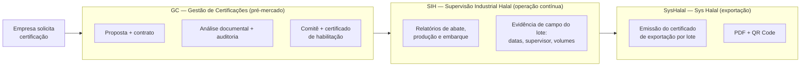

# Ecossistema Halal EcoHalal — Visão dos 3 Sistemas e Integração

> **Documento descritivo (não é manual).** Apresenta o propósito de cada sistema,
> quem os utiliza, suas principais funcionalidades e **como operam de forma integrada**
> ao longo da cadeia de certificação Halal.
>
> **Público:** Diretoria, Comercial, Marketing e Produto.
> **Última atualização:** 2026-07-14.

---

## 1. Resumo executivo

A EcoHalal opera um **ecossistema de três sistemas** que, juntos, cobrem o ciclo
completo da certificação Halal — da habilitação de uma empresa até a emissão do
certificado de exportação de cada lote embarcado. Cada sistema atende a um estágio
da jornada e a um público diferente, mas **compartilham dados e se integram** para
garantir rastreabilidade ponta a ponta.

| Sistema | Nome completo | Estágio na cadeia | Quem usa |
|---|---|---|---|
| **GC** | Gestão de Certificações | **Pré-mercado** — certifica a empresa | Certificadora (FAMBRAS) + empresas solicitantes |
| **SIH** | Supervisão Industrial Halal | **Operação contínua** — supervisiona a produção | Supervisores Halal em campo + coordenação |
| **SysHalal** | Sys Halal | **Exportação** — emite o certificado de cada embarque | Despachantes, clientes exportadores e a certificadora |

**A tese central do ecossistema:** cada sistema cobre uma etapa, mas a integração
entre eles permite uma **validação cruzada** que sistemas isolados não conseguem
fazer — confirmando, no momento de exportar, que a empresa está habilitada, que o
certificado está vigente, que o produto está no escopo **e** que aquele lote tem
evidência operacional real de supervisão Halal.

---

## 2. GC — Gestão de Certificações

### O que é e para que serve
O GC é a **plataforma SaaS de gestão do ciclo completo de certificação Halal** de uma
empresa — o "sistema de escritório" da certificadora. Ele governa todo o processo que
hoje é manual, disperso em e-mails, planilhas e PDFs, e o transforma em um fluxo único,
rastreável e automatizado, do primeiro contato comercial até a emissão do certificado
de habilitação. Toda a operação segue o procedimento **PR 7.1** e as normas
internacionais (GSO 2055-2, SMIIC, ISO 17065, GAC).

Na prática, o GC responde a três perguntas críticas da certificadora ao mesmo tempo:
*quanto cobrar* (proposta), *a empresa está conforme* (análise + auditoria) e
*podemos certificar* (decisão do comitê + emissão) — mantendo histórico completo de
cada decisão para fins de acreditação.

### Quem usa
- **Empresas solicitantes** — abrem a solicitação, preenchem o cadastro, enviam
  documentos e acompanham o andamento do processo em tempo real, sem precisar ligar.
- **Analistas (~15)** — revisam a solicitação, enquadram a classificação industrial,
  montam a proposta comercial, conduzem a análise documental e gerenciam o contrato.
- **Auditores (22)** — recebem a alocação, preparam-se com a documentação do processo,
  executam a auditoria presencial via checklist digital e registram não-conformidades.
- **Comitê Técnico (5-7)** — analisa o relatório de auditoria e toma a decisão formal
  (aprovar, reprovar ou pedir mais informações).
- **Gestão / Administração** — configura o sistema, acompanha KPIs e relatórios
  gerenciais e aloca recursos.

### Áreas funcionais (o que a plataforma faz)

**1. Solicitação e onboarding**
- Cadastro da empresa solicitante com **busca automática por CNPJ** (preenchimento
  assistido a partir de bases públicas).
- **Wizard de solicitação guiado** que conduz a empresa por todas as etapas do pedido.
- Upload e organização da documentação corporativa.
- **Grupos empresariais** (matriz + filiais) com documentos compartilhados, convites
  de usuários e workflow de validação de empresas.

**2. Proposta comercial e calculadora inteligente**
- **Calculadora multi-variável** que monta a proposta considerando, ao mesmo tempo,
  o tipo de certificação (C1-C6 da GSO 2055-2), a origem dos produtos, a quantidade
  de SKUs, o número de turnos, o histórico da empresa, a complexidade da cadeia de
  fornecedores e o deslocamento/hospedagem da equipe de auditoria.
- Geração da **proposta em PDF profissional** em segundos (no manual, levava horas/dias).

**3. Gestão colaborativa de contratos**
- Contrato estruturado em cláusulas, com **negociação e comentários cláusula a cláusula**,
  versionamento automático e visão lado a lado (original × editado).
- Encaminhamento para **assinatura digital** após aprovação.

**4. Análise documental (Estágio 1)**
- **Kanban de processos** com arrastar-e-soltar, preparado para centenas de processos
  simultâneos.
- Atribuição de analistas, **enquadramento da classificação industrial** (GSO 2055-2,
  hierárquica), checklist do estágio 1, solicitação de documentos adicionais e
  **comentários com @menções** entre as equipes.

**5. Auditorias (agendamento, execução e não-conformidades)**
- **Calendário inteligente** que agenda a auditoria considerando disponibilidade,
  especialização, localização e carga de trabalho dos auditores, evitando conflitos.
- **Checklist digital de auditoria** executado em campo, com **upload de evidências**
  (fotos/documentos com metadados).
- Registro estruturado de **não-conformidades** e do relatório de auditoria, com
  numeração sequencial automática.

**6. Decisão do comitê e emissão do certificado**
- **Painel do comitê** com os processos em decisão e o relatório de auditoria.
- Decisão formal registrada (aprovação, reprovação ou pedido de informações) com
  histórico completo.
- **Emissão do certificado digital** com **QR Code** e **página pública de verificação**
  de autenticidade.

**7. Conformidade, multi-país e administração**
- **Cadastro multi-país nativo** (ex.: a mesma operação com unidades no Brasil e no
  Paraguai modeladas como empresas distintas sob o mesmo grupo).
- **Modelo dual GSO/SMIIC** e catálogo de selos de múltiplos acreditadores.
- **Trilha de auditoria (audit trail) completa** de todas as ações — requisito de
  acreditação ISO 17065 / GAC.
- **Controle de acesso por perfil (RBAC)**, dashboards por papel e relatórios gerenciais.
- Engine de **PDFs multi-país com suporte a árabe (RTL)**.

**8. Inteligência artificial (em evolução)**
- **IA de análise pré-auditoria** (extração de produtos, ingredientes e fornecedores
  da documentação, sinalizando pontos críticos) e **assistente virtual multilíngue** —
  diferenciais já desenhados, em implementação progressiva.

### O ciclo em 12 fases
O processo é visualizado em 12 fases rastreáveis — *Solicitação → Análise preliminar →
Proposta → Revisão da proposta → Negociação de contrato → Contrato assinado →
Análise documental → Agendamento → Auditoria → Relatório → Decisão do comitê →
Certificado emitido* — com notificações automáticas a cada mudança de etapa.

### Resultados esperados
- Ciclo de certificação reduzido de **7-8 meses para 2-3 meses** (~60%).
- Forte redução de ligações reativas (a empresa acompanha tudo em tempo real).
- Conformidade auditável com 100% de rastreabilidade das decisões.

### Papel no ecossistema
O GC é o **master de cadastro** do ecossistema: é nele que vivem as fontes de verdade
de **Empresa, Planta, Escopo de certificação e Certificado de habilitação**. SIH e
SysHalal consomem esses dados.

### Status
🟡 **Pré-go-live.** Infraestrutura de produção no ar e **base real já carregada e
normalizada** (jul/2026): ~550 grupos, ~813 plantas, ~1.250 certificados e ~16,5 mil
produtos de escopo, além de ~500 matérias-primas homologadas — cruzando SysHalal,
SIGSIF, Receita Federal e formulários FM. A **emissão manual de certificado** já opera
em produção (QR Code novo, 15 selos, todos os gabaritos). **Go-live pleno com a FAMBRAS
previsto para agosto/2026.**

---

## 3. SIH — Supervisão Industrial Halal

### O que é e para que serve
O SIH é o sistema que **leva a certificação para dentro da fábrica, no dia a dia**.
A FAMBRAS Halal usa um conjunto de **formulários padronizados (FM)** para registrar
cada atividade de supervisão — abate, produção, embarque — e esses formulários são a
base documental que comprova a conformidade Halal dos produtos. Historicamente, eram
preenchidos **em papel**, gerando problemas de legibilidade, extravio, demora na
consolidação (2-5 dias) e ausência de visibilidade em tempo real.

O SIH é um **aplicativo web responsivo, otimizado para tablets em campo (PWA)**, que
digitaliza fielmente esses formulários. O supervisor preenche na própria planta, com
validação no momento da digitação, e o dado fica disponível **na hora** para a gestão —
estruturado, rastreável e auditável.

### Quem usa
- **Supervisores Halal (muçulmanos)** — preenchem os relatórios diretamente na planta,
  durante o turno de abate, produção ou embarque.
- **Coordenadores** — acompanham a equipe, a cobertura de supervisão e as não-conformidades.
- **Gestores** — têm visão consolidada em tempo real por planta, divisão e período.
- **Auditores / Administração** — localizam rapidamente qualquer relatório para auditoria.

### Áreas funcionais (o que a plataforma faz)

**1. Relatórios de abate** (FM 7.1.4.1 aves · FM 7.1.4.2 bovinos)
- Registro do abate com contagem de animais e os **itens de verificação Conforme/Não-Conforme
  específicos** de cada espécie (não são genéricos — seguem o modelo oficial).
- Seção de **insensibilização** (parâmetros do equipamento, conferências por turno),
  exclusiva do abate bovino.

**2. Relatórios de produção industrial** (FM 7.1.3.1 regular · FM 7.1.8.x especial)
- Registro da fabricação com **rastreabilidade completa das matérias-primas cárneas**
  (frigorífico de origem, SIF, data de abate, certificado Halal) e dos
  **ingredientes aprovados** (não cárneos).
- Distinção entre produção regular e produção especial.

**3. Relatórios de embarque** (FM 7.1.7.1 exportação · FM 7.1.7.4 venda interna · DCPOA transferência)
- Registro da movimentação dos produtos Halal com **tabela de produtos padrão** e campos
  condicionais por tipo (importador, container, portos e lacre na exportação; destino e
  evidência de entreposto na transferência, etc.).

**4. Não-conformidades** (FM 7.1.6.1)
- Abertura de NC a partir de qualquer relatório ou de forma avulsa, com **severidade**
  (crítica/maior/menor/observação) e **categoria** (higiene, processo, equipamento,
  matéria-prima, rotulagem…).
- **Workflow com prazo automático de 7 dias** (PR 7.1): aberta → em tratamento →
  resolvida → verificada → encerrada, com ações corretivas e preventivas.

**5. Registro diário de ocorrências**
- Registro do "mapa do dia" da operação (ex.: ocorrências do abate de aves), separado
  do checklist de não-conformidade.

**6. Catálogo de produtos e rastreabilidade origem → produção → embarque**
- **Catálogo de produtos Halal por planta**.
- **Vínculo do embarque à produção que o originou** — a cadeia documental é amarrada no
  sistema, sem redigitação, garantindo que o que é embarcado corresponde ao que foi produzido.

**7. Cadastros de base e escala de supervisores**
- Cadastro de **plantas** (com tipo, espécie, SIF/CNPJ) e de **colaboradores/supervisores**.
- **Escala de supervisão** por planta, data e turno (regular, substituição, extra, folga),
  garantindo que cada planta tenha cobertura Halal.

**8. Gestão, dashboards e segurança**
- **Dashboards consolidados** por perfil (supervisor, coordenador, gestor) e relatórios gerenciais.
- **Exportação dos relatórios em PDF** fiéis ao modelo FAMBRAS.
- **Histórico de acessos** ao sistema (login/logout) e gestão de **anexos** com armazenamento seguro.
- **Numeração serial automática** por planta (`SIF/ANO/SEQUENCIAL`) e regra de
  **cancelamento** (relatório cancelado recebe selo "CANCELADO"; o substituto recebe sufixo "A").

**9. Inventário (planejado)**
- Inventário de carne, de lotes de produção e de rotulagem, no modelo de **conta corrente**
  (saldo = entrada − saída) — modelo de dados já documentado para evolução futura.

### Resultados esperados
- Tempo de preenchimento de 15-25 min → **5-10 min**; consolidação de 2-5 dias → **tempo real**.
- Erros de preenchimento de ~15% → **<2%**; rastreabilidade **100% digital**.
- Prazos de não-conformidade controlados automaticamente (sem perder o limite de 7 dias).

### Papel no ecossistema
O SIH é a **camada operacional**: gera a **evidência de campo** (datas de abate,
supervisor responsável, volumes, lotes) que comprova que cada lote realmente passou por
supervisão Halal — a "porta 4" da validação cruzada (seção 5). Consome do GC os
cadastros de planta e o certificado Halal vigente.

### Status
🟡 **Pré-go-live / piloto controlado** com empresas selecionadas e dados reais
(jun–jul/2026). Já **consome em produção as matérias-primas homologadas do GC** — o
primeiro elo real de integração do ecossistema (a base técnica da "porta 4"). **Go-live
pleno com a FAMBRAS previsto para agosto/2026** (em conjunto com o GC).

---

## 4. SysHalal — Sys Halal

### O que é e para que serve
O SysHalal é a **plataforma operacional de emissão e gestão dos certificados Halal de
exportação**, organizada por embarque/lote. É a "porta final" da cadeia: quando um lote
certificado vai ser exportado, é no SysHalal que se gera o **documento oficial (PDF) com
QR Code de verificação**, no layout exigido pelo mercado/cliente de destino, integrável
a órgãos como o **Saudi Halal Center (SFDA)**.

É o sistema mais **maduro e consolidado** do ecossistema — está em produção desde
agosto/2025, com uma base real de empresas, plantas e certificados emitidos. Sua força
está na flexibilidade dos documentos: cada destino e cliente pode ter um layout próprio
de certificado, e todo o histórico de cada documento é preservado.

### Quem usa
- **Despachantes e clientes exportadores** — solicitam, acompanham e baixam os
  certificados dos embarques (um mesmo usuário pode operar para várias empresas).
- **A certificadora** — valida, emite, corrige e administra os documentos e os cadastros.

### Áreas funcionais (o que a plataforma faz)

**1. Emissão e gestão de certificados de exportação**
- **Criação, edição, busca e mudança de status** de certificados.
- **Geração do PDF do certificado** com **layout customizável por tipo e por mercado**
  e **QR Code** de verificação.
- **Importação de certificados em lote** (arquivo) e criação a partir do **legado**,
  preservando a origem (novo × legado).

**2. Cartas de correção**
- Emissão, edição e busca de **cartas de correção** vinculadas a um certificado, com
  geração de PDF próprio — para ajustes documentais sem comprometer a integridade do original.

**3. Histórico e rastreabilidade dos certificados**
- **Trilha completa de alterações** de cada certificado (criação, atualização, mudança
  de status) e registro de autorização de edição por data.

**4. Dashboard de certificações**
- Visão de **métricas** (total emitido, ativos, próximos do vencimento) e
  acompanhamento consolidado do acervo.

**5. Gestão de empresas e grupos**
- CRUD completo de **empresas** (criar, editar, ativar, listar por categoria) com
  histórico, **grupos empresariais** e suporte a múltiplas empresas-mãe.

**6. Agentes de embarque (forwarding agents)**
- Cadastro e gestão dos **agentes de embarque** e seu vínculo com as empresas.

**7. Configurações de domínio**
- Catálogos administráveis: **tipos de certificação, países, UFs, portos, tipos de
  transporte, cargos** e **lista de palavras proibidas** (validação de conteúdo dos documentos).

**8. Perfis, permissões e relatórios**
- Gestão de **perfis e permissões (RBAC)**, **upload de documentos** e
  **relatório de faturamento** exportável.

### Resultados / diferenciais
- Base de embarques consolidada e em operação real há mais tempo.
- **Layouts de certificado adaptáveis por país/cliente** — atende às exigências de
  diferentes mercados de destino.
- Caminho de integração com o ecossistema para a **validação cruzada** (combate à fraude documental).

### Papel no ecossistema
O SysHalal é o estágio **pós-emissão / exportação** e o **sistema de registro dos
embarques**. A evolução planejada é alinhá-lo ao GC (cadastro master) e habilitar a
**validação cruzada de 4 portas** (ver seção 5).

### Status
🟢 **Em produção desde agosto/2025.** Evoluções planejadas: API v2 (integração externa),
alinhamento com o GC e validação cruzada (set–out/2026).

---

## 5. Como os três sistemas funcionam integrados

### A jornada do cliente certificado

1. **GC (pré-mercado):** a empresa é habilitada — proposta, contrato, auditoria,
   decisão do comitê e emissão do **certificado de habilitação**. Aqui nascem os
   cadastros master: empresa, planta, escopo.
2. **SIH (operação contínua):** uma vez habilitada e em produção, o supervisor Halal
   registra no SIH a operação diária — abate, produção e embarque — gerando a
   **evidência operacional** de cada lote.
3. **SysHalal (exportação):** no momento de exportar um lote, é emitido o
   **certificado de exportação** correspondente.

### Pontos de integração (dados compartilhados)

- **GC → SIH:** o SIH consome do GC os cadastros de **planta** (pelo SIF) e o
  **certificado Halal vigente**. O GC é a fonte de verdade do cadastro.
- **GC → SysHalal:** habilitação da empresa, certificado vigente e escopo do produto.
- **SIH → SysHalal:** evidência operacional do lote (datas de abate, supervisor, volumes).

### O diferencial estratégico: validação cruzada de 4 portas

Para emitir um certificado de exportação, o ecossistema integrado consegue validar
**quatro condições** — algo que sistemas isolados no mercado normalmente não fazem:

| Porta | Validação | Fonte |
|---|---|---|
| 1 | Empresa habilitada | GC |
| 2 | Certificado de habilitação válido | GC |
| 3 | Produto dentro do escopo da habilitação | GC |
| 4 | **Lote com evidência operacional real de supervisão** | **SIH** |

A maioria dos sistemas globais valida apenas de 1 a 3 (documento contra documento).
Adicionar a **porta 4** — a evidência de campo do SIH — combate fraudes como
adulteração de QR Code, mistura de lotes e certificado de papel divergente da
operação real. **Essa é a vantagem competitiva central do ecossistema EcoHalal.**

> **O primeiro elo já está em produção:** desde jun/2026 o SIH consome as
> matérias-primas homologadas do GC — a base técnica da porta 4 está construída. A
> validação cruzada completa (lote a lote, na emissão) é uma evolução planejada
> (set–out/2026), à medida que o SysHalal é alinhado ao GC.

### Princípios de arquitetura que sustentam a integração
- **GC é o master de cadastro** (empresa, planta, escopo, certificado). Os demais consomem.
- **Multi-país nativo** desde o início (ex.: mesma operação com unidades em países diferentes
  como empresas distintas sob o mesmo grupo).
- **Coexistência, não absorção:** cada sistema mantém seu propósito; a integração
  é por API onde faz sentido, sem fundir contextos operacionais distintos.

---

## 6. Quadro comparativo dos três sistemas

| Dimensão | GC | SIH | SysHalal |
|---|---|---|---|
| **Estágio da cadeia** | Pré-mercado (habilitação) | Operação contínua (campo) | Exportação (por lote) |
| **Usuários** | Certificadora + empresas | Supervisores + coordenação | Despachantes + clientes + certificadora |
| **Entrega central** | Certificado de habilitação | Relatórios de supervisão (FM) | Certificado de exportação |
| **Papel no dado** | Master de cadastro | Evidência operacional | Registro de embarques |
| **Status** | Pré-go-live · base carregada (go-live ago/26) | Pré-go-live · piloto (go-live ago/26) | Em produção desde ago/25 |

---

## 7. Roadmap e cronograma

O cronograma consolidado dos três sistemas (fev/2026 → mai/2027), com o marco de
**go-live FAMBRAS em agosto/2026**, está mantido em formato Gantt e tem como fonte de
verdade o roadmap público da plataforma.

- **Gantt visual:** [`sih-docs/PLANNING/ROADMAP-GANTT-2026.md`](../../sih-docs/PLANNING/ROADMAP-GANTT-2026.md)
- **Fonte de verdade (conteúdo):** `halalsphere-backend/src/roadmap/roadmap-content.ts`
  (servido publicamente em `GET /public/roadmap`).

---

## 8. Fichas técnicas (material objetivo)

Para uso do Comercial, Marketing e Produto, há uma ficha técnica de uma página por sistema:

- [Ficha Técnica — GC](./FICHA-TECNICA-GC.md)
- [Ficha Técnica — SIH](./FICHA-TECNICA-SIH.md)
- [Ficha Técnica — SysHalal](./FICHA-TECNICA-SYSHALAL.md)
